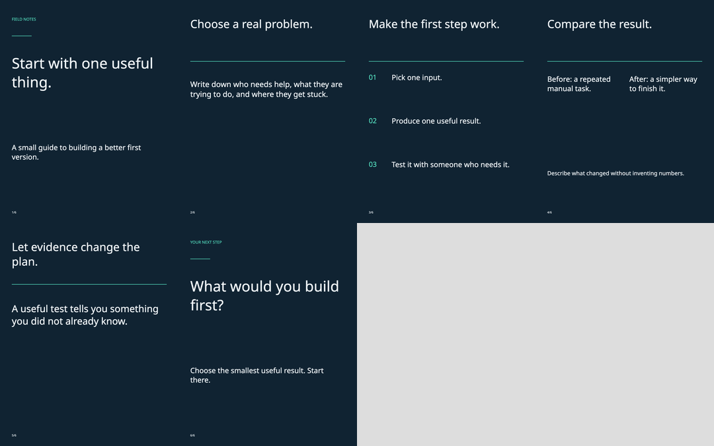
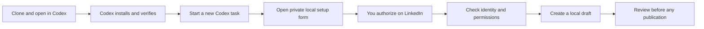

# Professional Publisher Community

Write LinkedIn posts in your voice, create slide decks, and publish reviewed drafts from **Codex or Claude**. Open source, MIT licensed, and local to your computer.

**Draft → preview → explicitly approve publication → receive the LinkedIn post link.**

This is an early community release. Publishing uses LinkedIn’s official APIs and your own developer app. Installation does not grant API access. Company publishing and member history access may require LinkedIn approval. No live posts are created by tests.

## New in v0.2

- One-command guided setup for Codex and Claude Code, source upgrades/rollback, and uninstall that preserves private data.
- Account disconnect, pending-job cancellation, credential cleanup, and voice-data removal.
- Draft editor with immutable revision comparison, destination selection, attachment ordering/removal and alt text. A source checklist and separate learning/publishing approvals keep review explicit.
- Voice Studio with editable rules, source evidence, manual preferences, disabled rules, held-out evaluation examples and writing comparisons.
- Monthly calendar with drag-to-review rescheduling and opt-in native notifications.
- Passphrase-encrypted backups containing local records and assets, plus GitHub-signed build provenance for release artifacts. Apple notarization and Windows Authenticode signing are not included.

See [v0.2 usage, maintenance and recovery](docs/V0.2.md) for exact behavior and limits.

## What is included

- Personal and company identities, with separate permission and format readiness.
- Text, link cards, single/multiple images, MP4 video, and PDF document posts.
- Local immutable drafts, attachment snapshots, processing checks, and durable receipts.
- Consent-based writing samples from Shares.csv, an archive containing Shares.csv, pasted samples, or permitted API history. The current AI assistant analyzes your voice; no additional model API key is needed.
- Versioned voice profiles, freeze/reset/export controls, and learning from explicitly approved edits.
- An idea bank and local dashboard for drafts, slides, voice settings, and scheduled jobs.
- Slide sources, PDF, editable PowerPoint, individual PNGs, and a contact sheet. English and Arabic fonts are included. Four themes, optional brand colors/logo, charts and custom layouts.
- Optional local scheduling. A reviewed draft is approved for a particular minute and time zone. A missed minute is skipped; uncertain submissions are never automatically reposted.



## Set it up with Codex

**You do not need to know MCP or configure everything by hand.** Clone this repository, open its folder in Codex, and ask Codex to run the setup. You will use a browser for LinkedIn developer-app setup and authorization; everyday drafting and publishing happen in your AI client.

### 1. Clone and open the folder

Install Git and a Codex client that can work with local files and run commands. Clone into a directory you intend to keep:

```sh
git clone https://github.com/Mohammed-Moniem/professional-publisher-community.git
cd professional-publisher-community
```

Open **that folder** as a project in Codex desktop, or run `codex` from that directory if you use the CLI. The plugin's generated configuration points to this folder, so moving or deleting it later requires setup again.

With Node.js 24+ installed, you can also run the guided setup directly:

```sh
node scripts/setup.mjs setup
```

For a known client: `node scripts/setup.mjs setup --client codex --yes --skip-connect` (use `claude` for Claude Code). This installs the local software and selected plugin; it does not connect an account, upload, publish, import history, or enable the scheduling worker. The wizard restores the portable source manifest after registration, so machine paths do not enter Git.

### 2. Paste this into Codex

```text
Set up Professional Publisher Community from this repository for me.
Read AGENTS.md, README.md, SETUP.md, and docs/ONBOARDING.md first.

Check my OS, Node.js 24+, npm, Git, and available Codex installation.
Install the project dependencies, build it, prepare Chromium, generate the
local client configuration, and install the Codex plugin. Preserve other
plugins and existing account data. If this plugin is already installed,
check its source before changing anything or adding a duplicate server.

Verify the runtime and tool discovery, then explain when I need to start
a new Codex task. Guide me through connecting my personal LinkedIn profile,
one step at a time. Let me enter app credentials only in the local setup
form, never in chat. Explain any LinkedIn approval that is still required.

Do not publish, upload media, import my post history, or enable scheduling
during setup. Finish with a clear report of what works and what still
needs my action, then help me create a local draft for review.
```

Codex handles the local commands. You handle LinkedIn login, developer-app details, consent, and any organization verification. Missing permissions or app approval cannot be fixed by installing the plugin.

### 3. Follow the checkpoints



| Checkpoint | What you should see | What it means |
|---|---|---|
| Local runtime | Build succeeds; doctor reports Node and renderer readiness | The software can run. Your LinkedIn account may still be disconnected. |
| Plugin loaded | The new task can call `get_workflow` and `check_capabilities` | Codex can reach the tools. Version 0.2.0 exposes 43 tools. |
| Account connected | Your selected identity and granted permissions are listed | OAuth worked. This does not prove every posting format has been tested. |
| First draft | Exact caption, destination, attachments and a review digest | Content is saved locally; nothing has been published. |

After installation, start a **new task in the same project** and say:

```text
Use Professional Publisher Community. Read its workflow and check my
connection. If disconnected, guide me through personal-profile setup.
Do not publish anything.
```

### What setup looks like

This is a **fictional wireframe**, not a screenshot of LinkedIn, Codex, or a user's environment. It illustrates the local form; actual browser layout may differ.

```text
┌─ LOCAL SETUP · ILLUSTRATION ONLY ─────────────────────┐
│ Connect your LinkedIn profile                         │
│                                                      │
│ 1. Create your own LinkedIn developer app.             │
│ 2. Enable the requested products.                     │
│ 3. Register the callback shown on this form.           │
│                                                      │
│ Client ID       [ Enter directly in this local form ] │
│ Client secret   [ Enter directly in this local form ] │
│                                                      │
│ Requested: openid · profile · w_member_social          │
│              [ Connect through LinkedIn ]             │
│                                                      │
│ Nothing is posted during setup.                       │
└──────────────────────────────────────────────────────┘
```

The personal app needs **Share on LinkedIn** for publishing and **Sign In with LinkedIn using OpenID Connect** for profile identification. See LinkedIn's official [publishing setup](https://learn.microsoft.com/en-us/linkedin/consumer/integrations/self-serve/share-on-linkedin) and [sign-in setup](https://learn.microsoft.com/en-us/linkedin/consumer/integrations/self-serve/sign-in-with-linkedin-v2). Enter your own app credentials only in the generated local form. Do not share its private session URL.

**Continue with the [step-by-step walkthrough and fictional examples](docs/ONBOARDING.md)** for developer-app setup, expected results, a first draft, optional voice learning, and common setup problems. [SETUP.md](SETUP.md) has the exact installation commands for Codex and Claude.

<details>
<summary>Prefer to run the local commands yourself?</summary>

From the cloned repository directory, with Node.js 24+ installed:

```sh
npm ci --ignore-scripts
npm run build
npx playwright install chromium
node scripts/install.mjs
npm run doctor
codex plugin marketplace add .
codex plugin add professional-publisher-community@professional-publisher-community
```

Start a new Codex task afterward. On Linux, use `npx playwright install --with-deps chromium` to install required system libraries. Linux credentials also require an unlocked desktop Secret Service. Video validation needs `ffprobe` from a current FFmpeg installation on PATH; it is not needed for a first text draft.

The installer writes machine-specific paths into `.mcp.json` and creates ignored `client-config/` files. These are local setup outputs, not files to include in a public contribution. See the [contributor privacy checklist](docs/ONBOARDING.md#contributing-setup-examples).

</details>

## Clients and platforms

| Client | Integration |
|---|---|
| Codex desktop / CLI | Plugin with writing skill and local stdio MCP |
| Claude Code | Plugin with the same skill and MCP engine |
| Claude Desktop | Platform-specific MCPB bundle, or manual local MCP configuration; call `get_workflow` for the skill instructions |
| Other local MCP clients | Generated `client-config/mcp.json` |

The runtime targets macOS, Windows, and Linux. Use clients officially available on your OS; this project does not provide Linux versions of desktop clients. CI tests those operating systems; desktop UI installation and OS credential-store behavior require host-specific verification. See [validation status](docs/VALIDATION.md).

Platform bundles generated by CI include Node, native dependencies, fonts, and Chromium. `ffprobe` remains an external prerequisite for video. Unsigned bundles are not an app-store listing or a vendor endorsement.

## Privacy and approval

Your credentials stay in the OS credential store. Drafts, imports, voice profiles, media and schedules stay in a separate per-user local directory outside plugin caches. Your current AI host receives the samples you choose to analyze and the tool results it requests. There is no additional AI service, hosted backend, or telemetry.

The tool caller must pass the user’s actual publication instruction and the reviewed draft digest. This is an assistant workflow contract, not an independent human identity attestation: another locally authorized MCP client can call the same tools. Never configure unattended clients to fabricate approvals.

Access tokens only refresh automatically when LinkedIn grants a usable refresh token. Both access and refresh credentials can expire or be revoked. There is no permanent-token switch.

Read [security and data handling](SECURITY.md), [architecture](docs/ARCHITECTURE.md), and [limitations](docs/VALIDATION.md).

## Development

```sh
npm test
npm audit --audit-level=low
node scripts/public-check.mjs
npm run release:pack
```

Tests use synthetic fixtures and mocked LinkedIn responses. Real rendering and stdio MCP tests run locally. No publishing token is required. Contributors should open an issue or pull request with reproduction steps and relevant test evidence. Do not attach credentials, private writing samples, local databases, or OAuth setup URLs.

LinkedIn, Codex, and Claude are trademarks of their respective owners. This is an independent community project.
